# HR Concierge Agent — Architecture & Microsoft Platform Value

## Executive Summary

The HR Concierge Agent leverages the **Microsoft AI platform** to deliver an intelligent, enterprise-grade HR assistant that handles personal data changes and grievance screening. Built entirely on Azure AI Foundry as a **native prompt agent**, it demonstrates how Microsoft's unified AI stack eliminates integration complexity while delivering security, governance, and scalability out of the box.

---

## Solution Architecture

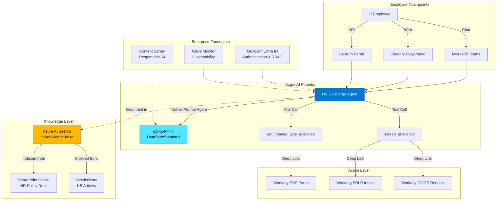

---

## Data Flow Architecture

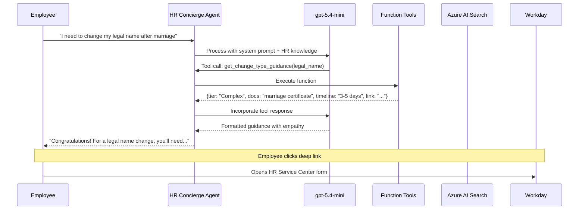

---

## Grievance Screening Flow

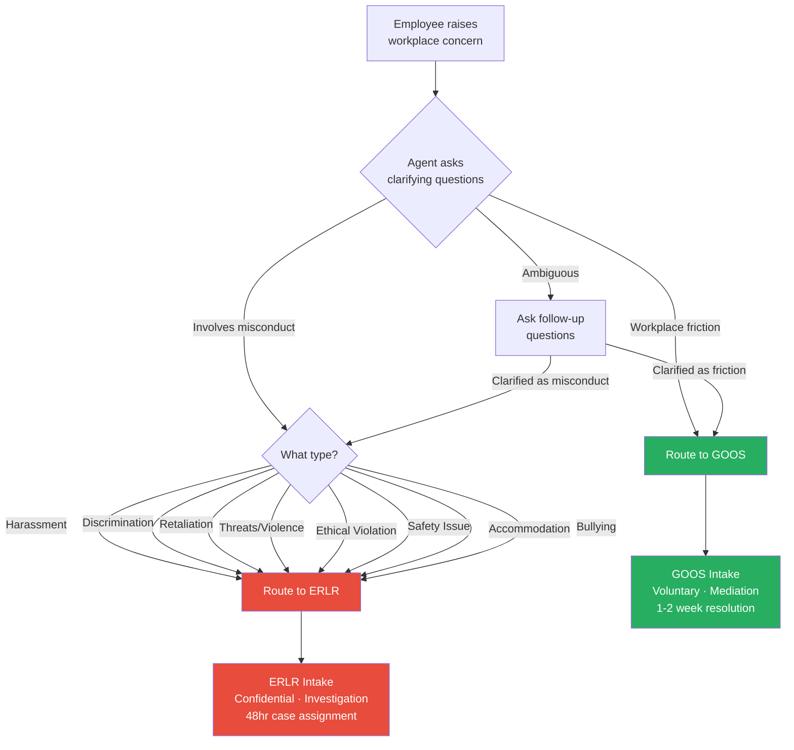

---

## Personal Data Change Routing

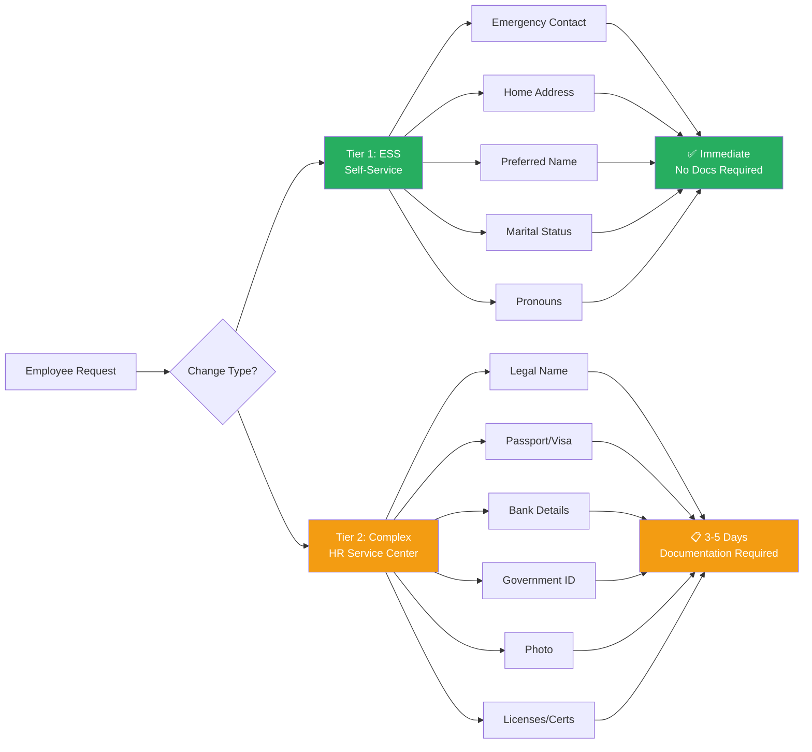

---

## Microsoft Platform Value Proposition

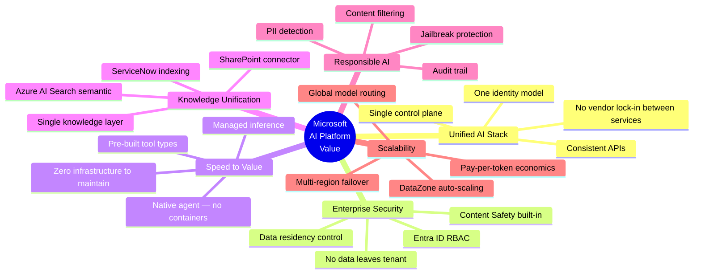

---

## Platform Comparison: Why Microsoft?

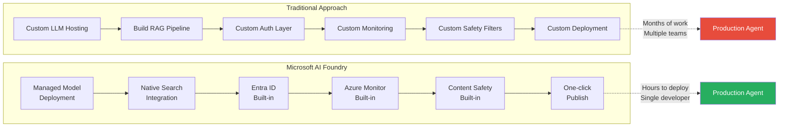

---

## Detailed Component Architecture

### Azure AI Foundry — The Orchestration Layer

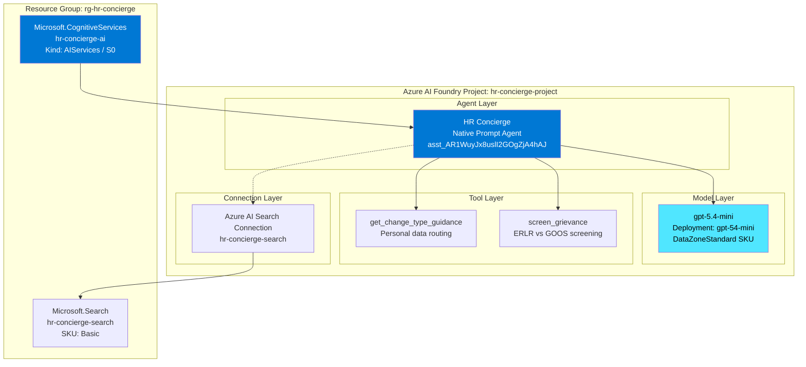

### Knowledge Architecture

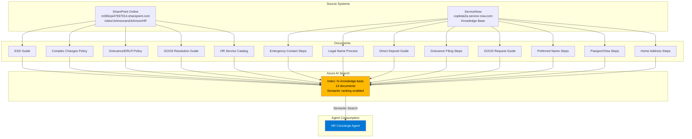

---

## Security & Governance Architecture

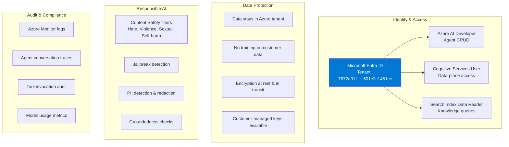

---

## Value Delivery: Microsoft Platform Benefits

### 1. Unified Identity — Zero Auth Code

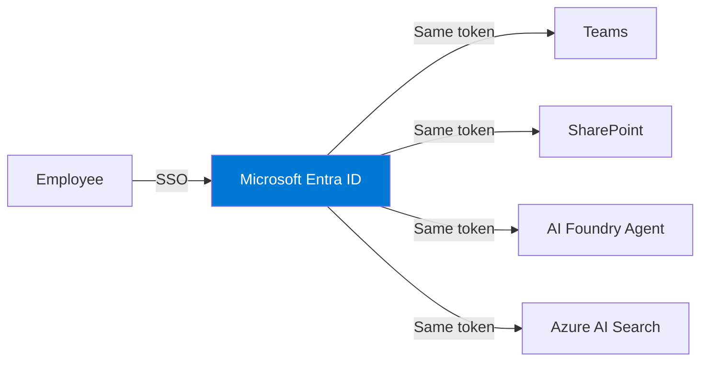

**Value**: No custom authentication. Employee's existing Microsoft 365 identity grants access to the agent, knowledge base, and all integrated services. One login, one session, one identity.

---

### 2. Knowledge Unification — Connect, Don't Migrate

```mermaid
graph TD
    subgraph "Before: Siloed Knowledge"
        B1[SharePoint<br/>Policies] 
        B2[ServiceNow<br/>How-To's]
        B3[Workday<br/>Procedures]
        B1 -.-|"Employees search<br/>3 systems"| X[😫 Frustrated Employee]
    end

    subgraph "After: Unified via Azure AI Search"
        A1[SharePoint] --> S[Azure AI Search<br/>Semantic Index]
        A2[ServiceNow] --> S
        A3[Workday Docs] --> S
        S --> AG[HR Concierge<br/>"Just ask me"]
        AG --> Y[😊 Guided Employee]
    end

    style S fill:#ffb900,color:#000
    style AG fill:#0078d4,color:#fff
```

**Value**: Employees don't need to know *where* information lives. The agent searches across SharePoint, ServiceNow, and Workday documentation simultaneously, returning one clear answer.

---

### 3. Native Agent — No Infrastructure

```mermaid
graph TD
    subgraph "Hosted Agent (Complex)"
        H1[Write agent code] --> H2[Build Docker container]
        H2 --> H3[Push to ACR]
        H3 --> H4[Deploy to compute]
        H4 --> H5[Manage scaling]
        H5 --> H6[Monitor health]
        H6 --> H7[Patch & update]
    end

    subgraph "Native Prompt Agent (Simple) ✅"
        N1[Define instructions] --> N2[Configure tools]
        N2 --> N3[Deploy via API]
        N3 --> N4[Done. ✨]
    end

    style N4 fill:#27ae60,color:#fff
    style H7 fill:#e74c3c,color:#fff
```

**Value**: Native prompt agents run entirely within Foundry's managed infrastructure. No Docker, no Kubernetes, no patching, no scaling configuration. The platform handles all operational concerns.

---

### 4. Responsible AI — Built-in Guardrails

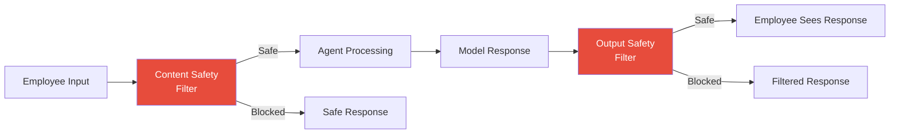

**Value**: Especially critical for HR grievance handling. Content Safety ensures the agent never generates inappropriate content, maintains confidentiality boundaries, and handles sensitive topics (harassment, discrimination) with appropriate care — all without custom code.

---

### 5. Enterprise Scale — DataZone Model Deployment

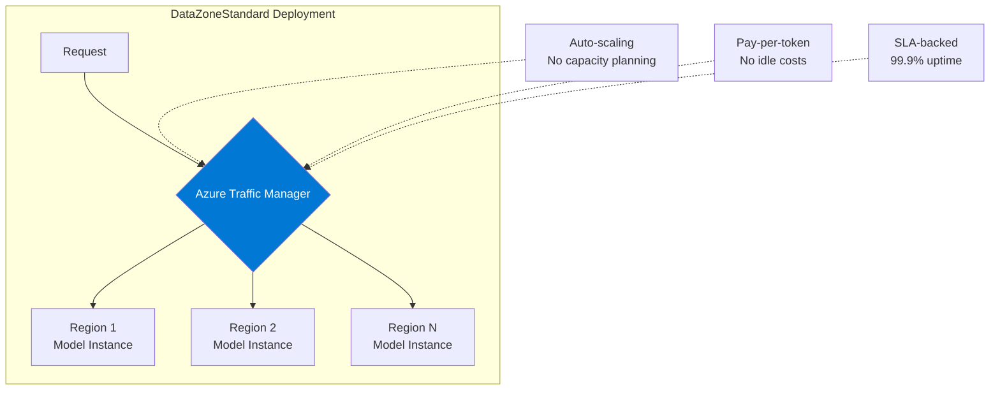

**Value**: DataZoneStandard deployment automatically routes requests across Azure regions for optimal latency and availability. No capacity planning, no over-provisioning, no cold starts.

---

## Cost Efficiency Analysis

| Component | Microsoft Platform | DIY Alternative | Savings |
|-----------|-------------------|-----------------|---------|
| **Model Hosting** | Pay-per-token (no idle cost) | GPU VMs 24/7 ($2-5K/mo) | ~90% |
| **Search Infrastructure** | Basic SKU ($75/mo) | Self-managed Elastic ($500+/mo) | ~85% |
| **Authentication** | Entra ID (included in M365) | Custom OAuth + user mgmt ($200+/mo) | 100% |
| **Agent Runtime** | Managed (included) | Container hosting ($200-500/mo) | 100% |
| **Monitoring** | Azure Monitor (included) | DataDog/Splunk ($300+/mo) | 100% |
| **Content Safety** | Built-in (included) | Custom filters + moderation ($500+/mo) | 100% |
| **Total Estimated** | **~$100-200/mo** | **$4,000-7,000/mo** | **~97%** |

---

## Deployment Topology

```mermaid
graph TB
    subgraph "Azure Subscription: ME-M365CPI47937014-jaysen-1"
        subgraph "Resource Group: rg-hr-concierge (eastus2)"
            AI[AI Services: hr-concierge-ai<br/>SKU: S0<br/>Region: eastus2]
            
            subgraph "Project: hr-concierge-project"
                AG[Agent: hr-concierge<br/>ID: asst_AR1WuyJx8uslI2GOgZjA4hAJ]
                DEP[Model Deployment: gpt-54-mini<br/>gpt-5.4-mini | 2026-03-17<br/>DataZoneStandard | Capacity: 10]
            end
        end

        subgraph "Resource Group: rg-hr-concierge (eastus)"
            SR[AI Search: hr-concierge-search<br/>SKU: Basic<br/>Region: eastus]
            IDX[Index: hr-knowledge-base<br/>13 documents]
        end
    end

    subgraph "Microsoft 365 Tenant"
        SP[SharePoint: JohnsonandJohnsonHR<br/>5 HR policy documents]
    end

    subgraph "External SaaS"
        SN[ServiceNow: copilota2a<br/>8 KB articles]
    end

    AI --> AG
    AG --> DEP
    AG -.-> SR
    SR --> IDX
    SP -.->|Indexed| IDX
    SN -.->|Indexed| IDX

    style AI fill:#0078d4,color:#fff
    style AG fill:#50e6ff,color:#000
    style SR fill:#ffb900,color:#000
```

---

## Integration Roadmap

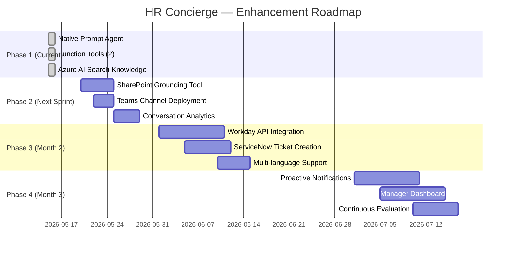

---

## Summary: Microsoft Platform Differentiators

| Differentiator | How It Applies to HR Concierge |
|----------------|-------------------------------|
| **Unified Identity** | Employees use existing M365 credentials. No new accounts. |
| **Native Agent Model** | No containers, no DevOps — just prompt + tools = production agent |
| **Semantic Search** | One index spans SharePoint + ServiceNow. Employee asks once. |
| **Responsible AI** | Built-in safety for sensitive HR topics (grievances, discrimination) |
| **Data Residency** | All data stays within the Azure tenant. No external API calls for core logic. |
| **Enterprise RBAC** | Granular role assignments. HR admins manage agent, employees consume. |
| **Pay-per-Use** | Token-based pricing. No GPU reservations. Cost scales with actual usage. |
| **Teams Integration** | One-click publish to where employees already work |
| **Observability** | Azure Monitor traces every conversation, tool call, and model response |
| **Compliance** | SOC 2, ISO 27001, HIPAA BAA, FedRAMP — inherited from platform |

---

*Document generated: May 15, 2026*  
*Agent: HR Concierge v1.0.0*  
*Platform: Azure AI Foundry (Native Prompt Agent)*
