# Custom Engine Agent Architecture — HR Concierge via M365 Copilot

## Executive Summary

This document details the architecture of the **HR Concierge Custom Engine Agent (CEA)** — an intelligent HR assistant that is surfaced through **Microsoft 365 Copilot** and powered by **Azure AI Foundry** as its custom AI orchestration engine. The agent uses the **Bot Framework** as its communication backbone, enabling employees to interact with it directly inside Microsoft Teams through the familiar Copilot experience.

A Custom Engine Agent is distinct from a Declarative Agent in that it brings its **own AI model and orchestration logic** rather than relying on the M365 Copilot orchestrator. This gives full control over the model, prompts, tools, grounding data, and conversation flow.

---

## What is a Custom Engine Agent?

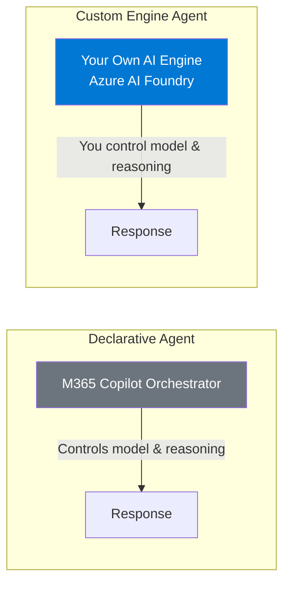

| Aspect | Declarative Agent | Custom Engine Agent |
|--------|------------------|---------------------|
| **AI Orchestration** | M365 Copilot orchestrator | Your own engine (Azure AI Foundry) |
| **Model Selection** | Microsoft-managed | You choose (gpt-5.4-mini, GPT-4o, etc.) |
| **Prompt Control** | Limited instructions | Full system prompt & instruction control |
| **Tool Execution** | Copilot-managed plugins | Custom function tools, Azure AI Search, APIs |
| **Grounding** | Microsoft Graph, SharePoint | Any data source (Search, SQL, APIs, files) |
| **Conversation State** | Copilot-managed | Self-managed threads & context |
| **Use Case** | Simple Q&A, data retrieval | Complex workflows, multi-turn reasoning, domain agents |

The HR Concierge uses the **Custom Engine Agent** pattern because it requires:
- Domain-specific system prompts with detailed HR process logic
- Custom function tools (`get_change_type_guidance`, `screen_grievance`)
- Azure AI Search grounding across SharePoint and ServiceNow
- Multi-turn conversation management for grievance screening
- Full control over response tone, SLAs, and deep linking behavior

---

## End-to-End Architecture

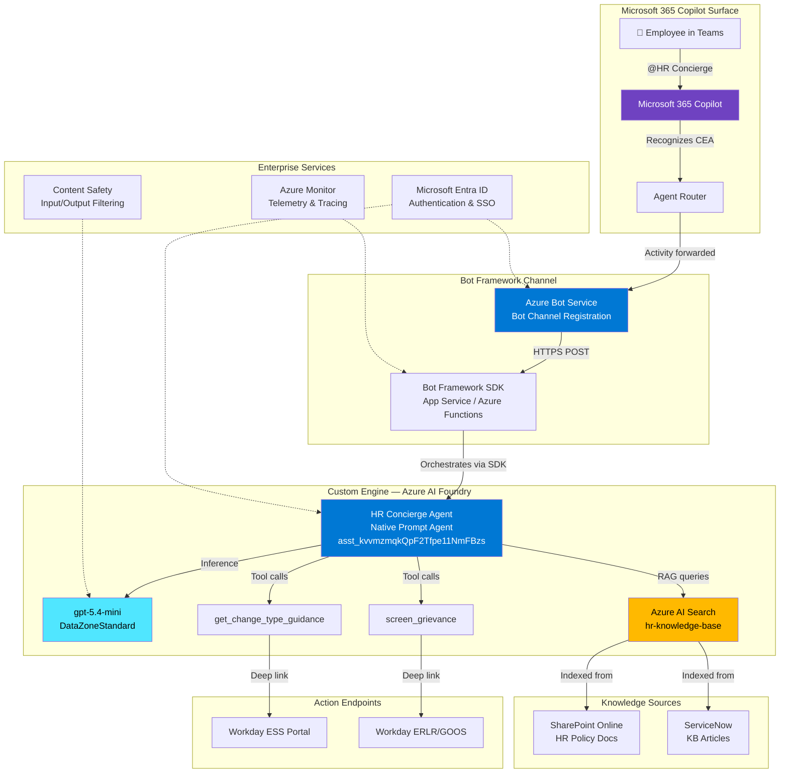

---

## Component Deep Dive

### 1. Microsoft 365 Copilot — The Surface Layer

Microsoft 365 Copilot acts as the **front door** for the employee. When the HR Concierge is registered as a Custom Engine Agent, it appears as a selectable agent within the Copilot experience in Teams.

**How employees invoke it:**
- Type `@HR Concierge` in Microsoft Teams chat
- Select "HR Concierge" from the Copilot agent picker
- Ask a question in the Copilot side panel and have it routed to the agent

**What M365 Copilot does:**
1. Presents the agent in the Teams Copilot UI
2. Captures the user's message
3. Identifies that this is a Custom Engine Agent (not a Declarative Agent)
4. Forwards the entire conversation turn to the registered bot endpoint
5. Renders the bot's response back to the user in the Teams UI

M365 Copilot does **NOT** perform any AI reasoning for a CEA — it is purely a routing and rendering layer.

---

### 2. Azure Bot Service — The Communication Backbone

```mermaid
graph TB
    subgraph "Azure Bot Service"
        REG[Bot Channel Registration<br/>Microsoft App ID: {app-id}<br/>Messaging Endpoint: https://hr-bot.azurewebsites.net/api/messages]
        
        subgraph "Channels"
            CH1[Microsoft Teams]
            CH2[Microsoft 365 Copilot]
            CH3[Web Chat — optional]
        end
        
        REG --> CH1
        REG --> CH2
        REG --> CH3
    end
    
    subgraph "Authentication"
        AAD[Microsoft Entra ID App Registration<br/>Client ID + Secret<br/>Bot Framework auth tokens]
    end
    
    AAD --> REG

    style REG fill:#0078d4,color:#fff
```

**Azure Bot Service** provides:

| Capability | Description |
|-----------|-------------|
| **Channel Abstraction** | Single bot endpoint serves Teams, Copilot, Web Chat, etc. |
| **Authentication** | Validates tokens between M365 Copilot and your bot endpoint |
| **Message Routing** | Delivers Activities (messages, events) to your bot code |
| **Protocol Handling** | Manages the Bot Framework Protocol (JSON over HTTPS) |
| **Scaling** | Handles connection management across thousands of concurrent users |

**Registration details:**
- **App Type**: Multi-tenant or Single-tenant Entra ID app
- **Messaging Endpoint**: `https://<your-app-service>.azurewebsites.net/api/messages`
- **OAuth Connection**: Used for SSO token exchange with the employee's identity

---

### 3. Bot Framework SDK — The Application Layer

The Bot Framework SDK is the **code that runs your bot logic**. It receives Activities from Azure Bot Service and produces responses.

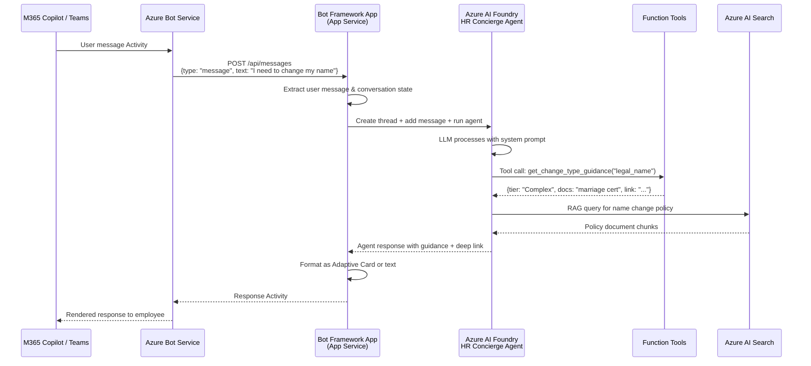

**Key Bot Framework components:**

#### a) `TeamsActivityHandler` (or `ActivityHandler`)

The main entry point for all incoming activities:

```python
from botbuilder.core import TurnContext
from botbuilder.core.teams import TeamsActivityHandler

class HRConciergeBot(TeamsActivityHandler):
    async def on_message_activity(self, turn_context: TurnContext):
        user_message = turn_context.activity.text
        
        # Forward to Azure AI Foundry agent
        agent_response = await self.run_foundry_agent(user_message, turn_context)
        
        # Send response back through Bot Framework
        await turn_context.send_activity(agent_response)
```

#### b) `BotFrameworkAdapter`

Handles HTTP layer, token validation, and channel communication:

```python
from botbuilder.integration.aiohttp import CloudAdapter, ConfigurationBotFrameworkAuthentication

adapter = CloudAdapter(ConfigurationBotFrameworkAuthentication(config))
```

#### c) Conversation State Management

Maintains thread IDs and conversation context across turns:

```python
from botbuilder.core import ConversationState, MemoryStorage

storage = MemoryStorage()  # Use CosmosDB/Blob for production
conversation_state = ConversationState(storage)
```

#### d) Adaptive Cards (Response Rendering)

Rich card UI for structured responses in Teams:

```json
{
  "type": "AdaptiveCard",
  "body": [
    {"type": "TextBlock", "text": "Legal Name Change", "weight": "Bolder", "size": "Medium"},
    {"type": "TextBlock", "text": "This is a Tier 2 (Complex) change requiring documentation.", "wrap": true},
    {"type": "FactSet", "facts": [
      {"title": "Required Docs", "value": "Marriage certificate or court order"},
      {"title": "Timeline", "value": "3-5 business days"},
      {"title": "Process", "value": "HR Service Center review"}
    ]}
  ],
  "actions": [
    {"type": "Action.OpenUrl", "title": "Open Workday HR Service Center", "url": "https://workday-simulator.../hr-service-center/complex-changes"}
  ]
}
```

---

### 4. Azure AI Foundry — The Custom AI Engine

This is the **brain** of the Custom Engine Agent. Azure AI Foundry hosts the native prompt agent with its model, instructions, and tools.

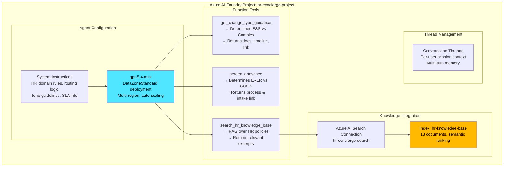

**Agent API interaction pattern (from the Bot):**

```
1. POST /threads                    → Create conversation thread
2. POST /threads/{id}/messages      → Add user message  
3. POST /threads/{id}/runs          → Execute agent reasoning
4. GET  /threads/{id}/runs/{id}     → Poll for completion
5. POST /threads/{id}/runs/{id}/submit_tool_outputs → Return tool results
6. GET  /threads/{id}/messages      → Retrieve agent response
```

**Why Azure AI Foundry as the engine:**
- Full control over system prompt (detailed HR routing logic)
- Native function tool support (no external orchestration needed)
- Built-in Azure AI Search integration for RAG
- Thread-based conversation management (multi-turn grievance screening)
- Content Safety applied at the model layer
- DataZoneStandard provides auto-scaling with no capacity planning

---

### 5. Azure AI Search — The Knowledge Layer

```mermaid
graph LR
    subgraph "Data Sources"
        SP[SharePoint Online<br/>5 HR Policy Documents]
        SN[ServiceNow<br/>8 KB Articles]
    end

    subgraph "Azure AI Search: hr-concierge-search"
        ING[Indexer Pipeline]
        IDX[Index: hr-knowledge-base<br/>13 documents]
        SEM[Semantic Ranker<br/>Understands HR intent]
        VEC[Vector Embeddings<br/>Hybrid search]
    end

    SP --> ING
    SN --> ING
    ING --> IDX
    IDX --> SEM
    IDX --> VEC

    subgraph "Query Flow"
        AGT[Agent asks:<br/>"name change policy"] --> SEM
        SEM --> RES[Top-K ranked results<br/>returned to agent context]
    end

    style IDX fill:#ffb900,color:#000
    style SEM fill:#ff6f00,color:#fff
```

**Indexed content:**

| Source | Documents | Content |
|--------|-----------|---------|
| SharePoint Online | 5 | ESS Guide, Complex Changes Policy, Grievance/ERLR Policy, GOOS Resolution Guide, HR Service Catalog |
| ServiceNow KB | 8 | Emergency Contact Steps, Legal Name Process, Direct Deposit Guide, Grievance Filing Steps, GOOS Request Guide, Preferred Name Steps, Passport/Visa Steps, Home Address Steps |

**Search capabilities:**
- **Semantic ranking** — understands natural language HR queries
- **Hybrid search** — combines keyword + vector similarity
- **Chunk-level retrieval** — returns most relevant passages, not entire documents

---

### 6. Microsoft Entra ID — Identity & Security

```mermaid
graph TB
    subgraph "Identity Flow"
        EMP[Employee<br/>VanceD@contoso.com] -->|SSO via M365| TEAMS[Microsoft Teams]
        TEAMS -->|Token exchange| BOT[Bot Service<br/>validates identity]
        BOT -->|Managed Identity| FOUNDRY[Azure AI Foundry<br/>agent execution]
        FOUNDRY -->|RBAC| SEARCH[Azure AI Search<br/>query index]
    end

    subgraph "App Registrations"
        APP1[Bot App Registration<br/>Client ID + Secret<br/>Teams channel permissions]
        APP2[AI Services Identity<br/>Managed Identity<br/>Cognitive Services User role]
    end

    subgraph "RBAC Assignments"
        R1[Azure AI Developer → Agent CRUD]
        R2[Cognitive Services User → Agent invocation]
        R3[Search Index Data Reader → Knowledge queries]
    end

    style EMP fill:#0078d4,color:#fff
```

**Security model:**
- Employee authenticates via existing M365 credentials (SSO)
- Bot validates incoming tokens using Bot Framework authentication
- Bot-to-Foundry calls use Managed Identity (no secrets in code)
- Foundry-to-Search uses connection-based RBAC
- All data stays within the Azure tenant boundary

---

### 7. Function Tools — The Action Layer

The agent has two primary function tools that drive its HR workflow logic:

#### `get_change_type_guidance`

```mermaid
flowchart TD
    A[Agent receives:<br/>"I need to change my legal name"] --> B[LLM determines tool call needed]
    B --> C[Tool: get_change_type_guidance<br/>change_type = "legal_name"]
    C --> D{Routing Logic}
    D -->|ESS types| E[Return: Tier 1<br/>No docs, immediate<br/>ESS deep link]
    D -->|Complex types| F[Return: Tier 2<br/>Docs required, 3-5 days<br/>HR Service Center link]
    F --> G[Agent formats response:<br/>"You'll need a marriage certificate...<br/>Here's the link to get started."]
```

**Input:** `change_type` enum (one of 10 HR change categories)  
**Output:** Tier classification, required documents, timeline, process steps, deep link URL

#### `screen_grievance`

```mermaid
flowchart TD
    A[Agent receives:<br/>"My manager is discriminating against me"] --> B[LLM asks clarifying questions]
    B --> C[Employee provides details]
    C --> D[Tool: screen_grievance<br/>involves_misconduct = true<br/>category = "discrimination"]
    D --> E{Routing Decision}
    E -->|Serious misconduct| F[ERLR Path<br/>Confidential investigation<br/>48hr case assignment]
    E -->|Workplace friction| G[GOOS Path<br/>Voluntary mediation<br/>1-2 week resolution]
    F --> H[Agent responds with empathy,<br/>confidentiality assurance,<br/>and ERLR intake link]
```

**Input:** concern summary, misconduct flag, category enum  
**Output:** Recommended path (ERLR/GOOS), process overview, timeline, protections, deep link

---

## Complete Request Flow — Step by Step

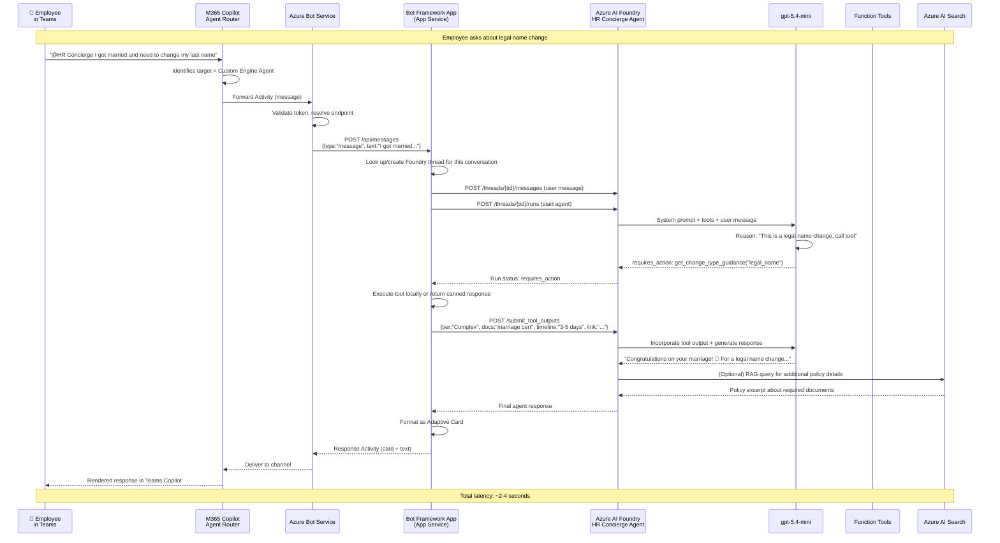

---

## App Manifest & Agent Declaration

To register as a Custom Engine Agent in M365 Copilot, the app requires a **Teams App Manifest** and an **Agent Declaration**.

### Teams App Manifest (`manifest.json`)

```json
{
  "$schema": "https://developer.microsoft.com/json-schemas/teams/v1.19/MicrosoftTeams.schema.json",
  "manifestVersion": "1.19",
  "version": "1.0.0",
  "id": "{{BOT_APP_ID}}",
  "name": {
    "short": "HR Concierge",
    "full": "HR Concierge — AI HR Assistant"
  },
  "description": {
    "short": "Get help with personal data changes and workplace concerns",
    "full": "HR Concierge helps employees navigate personal data changes (ESS vs HR Service Center) and screens workplace grievances for proper routing (ERLR vs GOOS)."
  },
  "icons": {
    "color": "color.png",
    "outline": "outline.png"
  },
  "developer": {
    "name": "Contoso HR",
    "websiteUrl": "https://contoso.com/hr",
    "privacyUrl": "https://contoso.com/privacy",
    "termsOfUseUrl": "https://contoso.com/terms"
  },
  "bots": [
    {
      "botId": "{{BOT_APP_ID}}",
      "scopes": ["personal", "team", "groupChat"],
      "supportsFiles": false,
      "isNotificationOnly": false
    }
  ],
  "copilotAgents": {
    "customEngineAgents": [
      {
        "type": "customEngine",
        "id": "hrConcierge",
        "file": "agent.json"
      }
    ]
  },
  "validDomains": [
    "hr-bot.azurewebsites.net",
    "workday-simulator.grayplant-4b62ead6.eastus2.azurecontainerapps.io"
  ]
}
```

### Agent Declaration (`agent.json`)

```json
{
  "$schema": "https://developer.microsoft.com/json-schemas/copilot/plugin/v1.0/schema.json",
  "name": "HR Concierge",
  "description": "AI-powered HR assistant for personal data changes and workplace grievance screening",
  "instructions": "You are HR Concierge, Contoso's AI HR assistant. Help employees with personal data changes and grievance screening. Use your tools to provide accurate routing and deep links.",
  "capabilities": [
    {
      "name": "conversation",
      "description": "Multi-turn conversations about HR processes, personal data changes, and workplace concerns"
    }
  ],
  "conversation_starters": [
    {"text": "I need to update my emergency contact"},
    {"text": "How do I change my legal name after marriage?"},
    {"text": "I want to report a workplace concern"},
    {"text": "What's the process for updating my bank details?"}
  ]
}
```

---

## Hosting Infrastructure

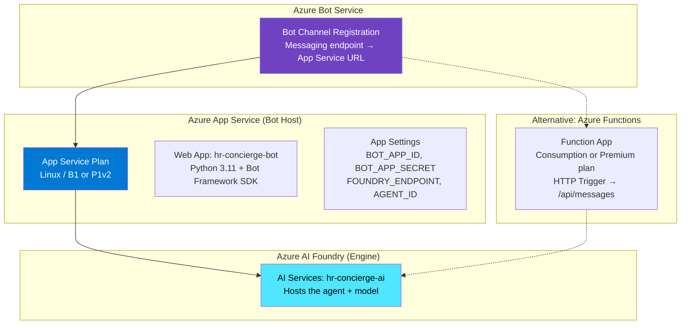

**Hosting options:**

| Option | Best For | Scaling | Cost |
|--------|----------|---------|------|
| **Azure App Service** | Always-on, predictable traffic | Manual/Auto scale rules | ~$55-200/mo |
| **Azure Functions (Consumption)** | Bursty traffic, cost-sensitive | Auto (0 to N instances) | Pay-per-execution |
| **Azure Functions (Premium)** | Low latency + scale | Pre-warmed instances | ~$150+/mo |
| **Azure Container Apps** | Containerized, microservices | KEDA-based auto-scale | ~$50-150/mo |

---

## Bot Framework Project Structure

```
hr-concierge-bot/
├── app.py                      # Entry point — HTTP server + adapter
├── bot.py                      # HRConciergeBot class (TeamsActivityHandler)
├── config.py                   # Environment config (App ID, secrets, endpoints)
├── foundry_client.py           # Azure AI Foundry agent interaction
├── cards/
│   ├── change_guidance.json    # Adaptive Card template for data changes
│   ├── grievance_result.json   # Adaptive Card template for grievance routing
│   └── welcome.json            # Welcome card for first interaction
├── manifest/
│   ├── manifest.json           # Teams app manifest
│   ├── agent.json              # Custom Engine Agent declaration
│   ├── color.png               # App icon (192x192)
│   └── outline.png             # App icon outline (32x32)
├── requirements.txt            # Python dependencies
├── Dockerfile                  # Container build
└── infra/
    ├── main.bicep              # Infrastructure as Code
    ├── bot.bicep               # Bot Service + App Registration
    └── parameters.json         # Deployment parameters
```

---

## Key Dependencies

| Package | Purpose |
|---------|---------|
| `botbuilder-core` | Core Bot Framework abstractions |
| `botbuilder-integration-aiohttp` | HTTP adapter for receiving Activities |
| `botbuilder-dialogs` | (Optional) Multi-step dialog management |
| `azure-identity` | Managed Identity authentication to Foundry |
| `azure-ai-agents` | Azure AI Foundry agent SDK |
| `aiohttp` | Async HTTP server |
| `adaptivecards` | (Optional) Card template rendering |

---

## How M365 Copilot Discovers and Routes to the CEA

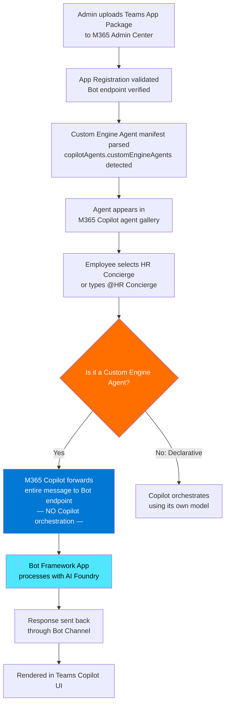

**Key insight:** For a Custom Engine Agent, M365 Copilot acts as a **pass-through**. It does not apply its own reasoning, grounding, or orchestration. The entire AI logic lives in your custom engine (Azure AI Foundry).

---

## Conversation State Management

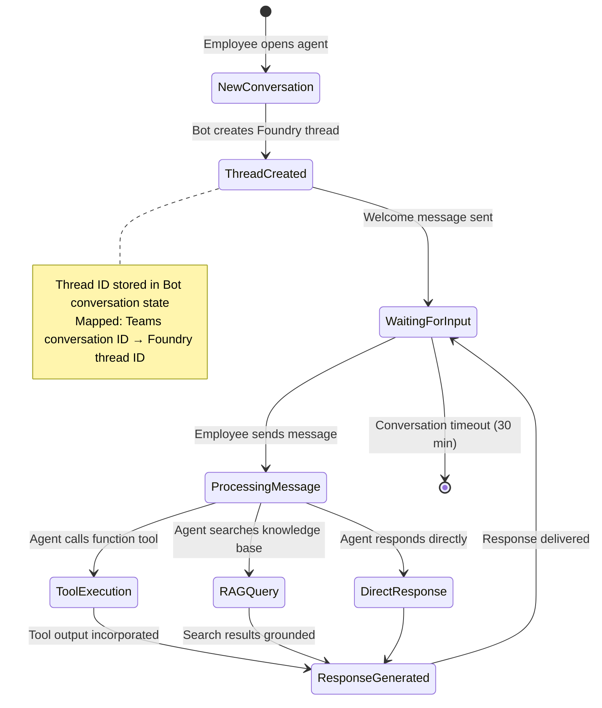

**State mapping:**
- Each Teams conversation maps to one Azure AI Foundry **thread**
- The Bot Framework maintains this mapping using `ConversationState`
- Foundry threads preserve full conversation history (multi-turn support)
- Thread context enables the agent to ask follow-up questions during grievance screening

---

## Security Architecture

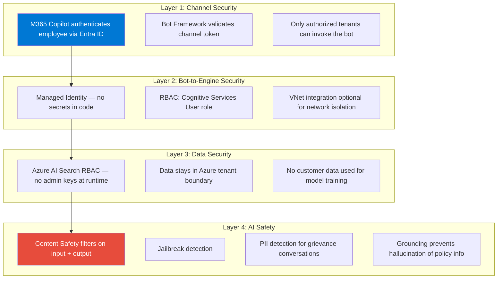

---

## Monitoring & Observability

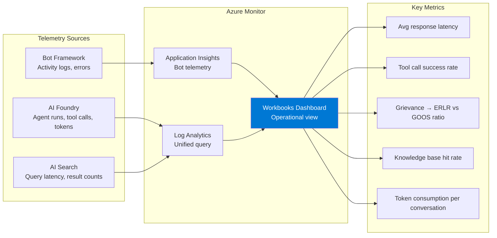

---

## Deployment Pipeline

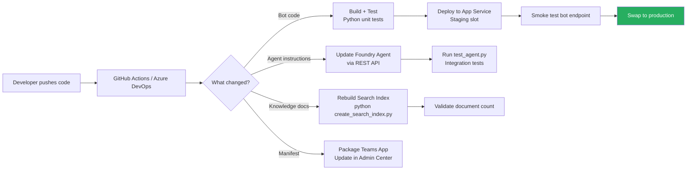

---

## Summary: Why Custom Engine Agent for HR Concierge

| Requirement | Why CEA (not Declarative Agent) |
|-------------|-------------------------------|
| **Complex routing logic** | System prompt with detailed tier classification rules |
| **Custom function tools** | `get_change_type_guidance` and `screen_grievance` with enum-driven logic |
| **Multi-turn grievance screening** | Agent must ask clarifying questions before routing |
| **Domain-specific RAG** | Azure AI Search over SharePoint + ServiceNow (not just Graph) |
| **Controlled tone & empathy** | Full system prompt control for sensitive HR conversations |
| **Deep linking to Workday** | Tool outputs include specific portal URLs |
| **SLA communication** | Agent must cite exact timelines (immediate, 3-5 days, 48 hours) |
| **Confidentiality guarantees** | ERLR responses must include protection language |

---

## Architecture Decision Records

### ADR-1: Custom Engine Agent over Declarative Agent
**Decision:** Use Custom Engine Agent pattern  
**Rationale:** HR grievance screening requires multi-turn reasoning, custom tools, and full prompt control that Declarative Agents cannot provide.

### ADR-2: Azure AI Foundry Native Prompt Agent as Engine
**Decision:** Use Foundry native agent (not hosted container agent)  
**Rationale:** No custom code in the AI layer. Instructions + tools + search = full functionality. Zero infrastructure for the AI engine itself.

### ADR-3: Bot Framework as Communication Layer
**Decision:** Use Bot Framework SDK with Azure Bot Service  
**Rationale:** Required for M365 Copilot integration. Provides channel abstraction, authentication, and Adaptive Card rendering.

### ADR-4: Azure AI Search for Knowledge
**Decision:** Unified search index over SharePoint + ServiceNow  
**Rationale:** Employees shouldn't need to know which system holds the answer. Semantic ranking ensures the most relevant policy content surfaces.

### ADR-5: Function Tools over Code Interpreter
**Decision:** Use function tools with deterministic routing logic  
**Rationale:** HR routing must be predictable and auditable. Deterministic tool logic (enum → tier mapping) is safer than LLM-generated code for compliance-critical decisions.

---

## Comparison: Architecture Layers

| Layer | Technology | Role |
|-------|-----------|------|
| **Surface** | Microsoft 365 Copilot + Teams | Where employees interact |
| **Communication** | Azure Bot Service + Bot Framework SDK | Message routing & auth |
| **Application** | Python Bot (App Service / Functions) | Orchestration glue code |
| **AI Engine** | Azure AI Foundry (Native Prompt Agent) | Reasoning, tool calling, RAG |
| **Model** | gpt-5.4-mini (DataZoneStandard) | Language understanding & generation |
| **Knowledge** | Azure AI Search (Semantic) | Policy document retrieval |
| **Data Sources** | SharePoint Online + ServiceNow | Authoritative HR content |
| **Actions** | Workday deep links | Employee self-service portals |
| **Identity** | Microsoft Entra ID | SSO, RBAC, token validation |
| **Safety** | Azure Content Safety | Input/output filtering |
| **Observability** | Azure Monitor + App Insights | Telemetry, tracing, dashboards |

---

*Document created: July 20, 2026*  
*Agent: HR Concierge v3.0.0*  
*Pattern: Custom Engine Agent (M365 Copilot → Bot Framework → Azure AI Foundry)*
